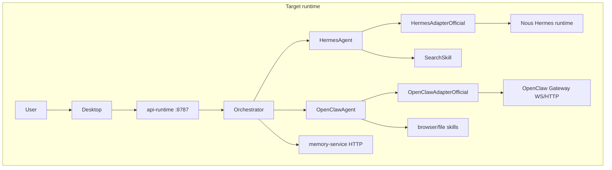
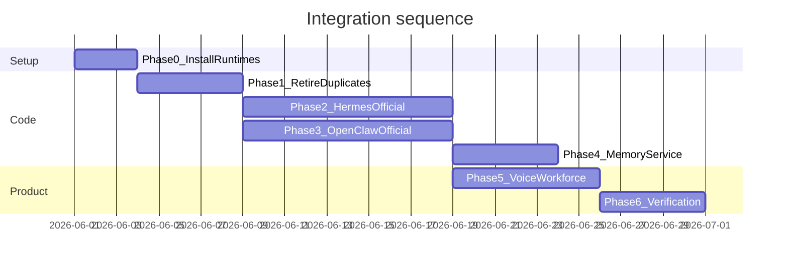

# Real Hermes + OpenClaw Integration Plan

## Current state (audit summary)

Aapke repo mein **architecture sahi hai** (UI → API → Orchestrator → Agents → Skills), lekin **asli power abhi Jarvis ke andar duplicate modules se aa rahi hai**, official adapters se nahi:

| Layer | Aaj kya chal raha hai | Kya missing hai |
|-------|----------------------|-----------------|
| **Hermes** | [`HermesAdapterStub`](agents/hermes/adapter/src/hermes-adapter-stub.ts) default; optional deterministic [`HermesPlanningAdapter`](agents/hermes/adapter/official/src/hermes-planning-adapter.ts); orchestrator **alag se** `llmProviderRuntime.executePrompt()` ([`create-task-executor.ts`](services/orchestrator/src/task-execution/create-task-executor.ts) ~712–752) | [`HermesAdapterOfficial`](docs/HERMES_INTEGRATION_PLAN.md) — **implement nahi hua** |
| **OpenClaw** | Gateway handshake + **Jarvis Playwright** ([`browser-execution-runtime.ts`](agents/openclaw/src/execution-runtime/browser-execution-runtime.ts)); adapter hamesha `stub` mode ([`create-openclaw-adapter-from-provider.ts`](agents/openclaw/adapter/src/create-openclaw-adapter-from-provider.ts)) | [`OpenClawAdapterOfficial`](docs/OPENCLAW_INTEGRATION_PLAN.md) — **implement nahi hua** |
| **Memory** | [`@jarvis/local-memory`](services/local-memory) on hot path | [`@jarvis/memory-service`](services/memory-service) — wired nahi |

Target external systems (aap ne confirm kiya):

- **Hermes:** [NousResearch/hermes-agent](https://github.com/NousResearch/hermes-agent) — planning/reasoning runtime (Python)
- **OpenClaw:** [openclaw/openclaw](https://github.com/openclaw/openclaw) — gateway (Node, default **18789**)



---

## Phase 0 — Machine setup (Windows, ~1–2 days)

**Goal:** Dono external runtimes locally reachable hon — bina iske adapter code ka koi faida nahi.

### 0A — OpenClaw gateway (WSL2 recommended)

Official docs: Windows par **WSL2** prefer ([`docs/OPENCLAW_INTEGRATION_PLAN.md`](docs/OPENCLAW_INTEGRATION_PLAN.md) §9.2).

1. WSL2 + Ubuntu install; Node 20+ in WSL.
2. OpenClaw install per [docs.openclaw.ai](https://docs.openclaw.ai) / GitHub README.
3. Gateway start (loopback **18789**); token set: `OPENCLAW_GATEWAY_TOKEN` (docs §4.1).
4. Health check: discovery adapter already expects endpoint — align env:
   - Repo reads `OPENCLAW_MODE` + `OPENCLAW_ENDPOINT` ([`openclaw-runtime-env.ts`](agents/openclaw/adapter/official/src/openclaw-runtime-env.ts))
   - Fix drift: [`.env.example`](.env.example) uses `OPENCLAW_GATEWAY_URL` — standardize to **`OPENCLAW_ENDPOINT=http://127.0.0.1:18789`** (single name)

### 0B — Nous Hermes Agent (Python)

Per [`docs/HERMES_INTEGRATION_PLAN.md`](docs/HERMES_INTEGRATION_PLAN.md):

1. Python venv + `hermes-agent` install (CLI/API per upstream README).
2. Local endpoint (default discovery: `http://127.0.0.1:8080` in [`hermes-runtime-env.ts`](agents/hermes/adapter/official/src/hermes-runtime-env.ts)).
3. Model keys (OpenRouter/OpenAI/etc.) — Jarvis `.env` se **sirf orchestrator** use kare; Hermes subprocess ko env pass karein, UI mein kabhi expose na karein.

### 0C — Jarvis `.env` (real mode baseline)

```env
HERMES_MODE=official
HERMES_ENDPOINT=http://127.0.0.1:8080
HERMES_PLANNING_ADAPTER=planning   # interim until HermesAdapterOfficial

OPENCLAW_MODE=official
OPENCLAW_ENDPOINT=http://127.0.0.1:18789
OPENCLAW_GATEWAY_TOKEN=<from gateway setup>

JARVIS_ALLOW_LLM_STUB_FALLBACK=false
GROQ_API_KEY=...                  # voice/search until Hermes owns more
SERPER_API_KEY=...
JARVIS_BROWSER_REAL=false           # Phase 3 ke baad gateway browser prefer
```

**Exit criteria:** Manual curl/WS probe to both endpoints; desktop Runtime Health shows configured (discovery adapters).

---

## Phase 1 — Retire duplicates (1 sprint, code changes)

**Goal:** Ek planner, ek executor — warna official adapters ke baad bhi purana logic chalega.

| Action | File(s) | Kya karna hai |
|--------|---------|----------------|
| **Single planner for `automate`** | [`create-task-executor.ts`](services/orchestrator/src/task-execution/create-task-executor.ts) | `llmProviderRuntime.executePrompt()` ko **gate** karo: sirf tab jab `HERMES_MODE=stub` ya explicit fallback; `official` mode mein planning **sirf** `HermesAgent` → adapter |
| **Single intent authority** | [`intent-classifier.ts`](apps/desktop/src/renderer/intent/intent-classifier.ts), API validators | Short-term: classifier **hint** rahe, lekin orchestrator/Hermes final `intent.kind` na override kare; long-term: optional `intent.kind: "default"` + Hermes classifies |
| **Stop forcing stub on Hermes** | [`create-hermes-adapter-from-provider.ts`](agents/hermes/adapter/src/create-hermes-adapter-from-provider.ts) | `forceStubMode` false when `HERMES_MODE=official` + official inner adapter |
| **OpenClaw adapter mode** | [`create-openclaw-adapter-from-provider.ts`](agents/openclaw/adapter/src/create-openclaw-adapter-from-provider.ts) | `official` mode → delegate to `OpenClawAdapterOfficial`, **not** inner stub |
| **Workforce stub executor** | [`agent-workforce-runtime.ts`](services/orchestrator/src/agent-workforce/agent-workforce-runtime.ts) | Default executor = `executeAgent(registry, …)` per worker type; stub sirf tests |
| **Conversations dead path** | [`stub_orchestrator_client.py`](services/api-gateway/app/clients/stub_orchestrator_client.py) | Either wire to `executeCreateTask` ya route disable until real — chat already uses `POST /tasks` |

**Exit criteria:** `automate` task output mein **ek** `plan` source (Hermes adapter); orchestrator output mein duplicate `llmPlanningContext` na ho (official mode).

---

## Phase 2 — HermesAdapterOfficial (spike → production, ~1–2 weeks)

**Spec:** [`docs/HERMES_INTEGRATION_PLAN.md`](docs/HERMES_INTEGRATION_PLAN.md) §4.2, §7.

### 2A — Spike (2–3 days)

New module: `agents/hermes/adapter/official/src/hermes-adapter-official.ts`

- `invoke(HermesRequest)` → external runtime (pick **one** bridge first):
  - **Option A (recommended v1):** HTTP/JSON sidecar if Nous exposes stable local API
  - **Option B:** subprocess CLI with timeout + structured stdout parse
- Map → existing `HermesResponse` (`plan`, `reasoning`, `stub: false`)
- Timeouts aligned with orchestrator task budget (doc open question: define e.g. 60s planning cap)

Tests: integration test with **mock HTTP server** (no live Nous in CI); live test behind `HERMES_INTEGRATION_LIVE=1`.

### 2B — Bootstrap wiring

[`resolve-hermes-adapter.ts`](agents/hermes/adapter/official/src/resolve-hermes-adapter.ts):

```typescript
// When HERMES_MODE === 'official' → createHermesAdapterOfficial()
// Else → stub | planning (dev only)
```

[`register-default-agents.ts`](agents/bootstrap/src/index.ts) — already uses `createResolvedHermesAdapter`; no orchestrator signature change.

### 2C — Memory bridge (Hermes rule)

- Add thin **Memory Service client** in adapter (or orchestrator injects recalled snippets — already in gateway request).
- Replace string `"via-memory-service-api-only"` in [`hermes-agent.ts`](agents/hermes/src/hermes-agent.ts) with real `memoryApi.search()` when Phase 4 complete.

**Exit criteria:** Desktop `automate` / `plan` shows non-stub Hermes plan from Nous; Phase 100C-style probe adds **Hermes official** check.

---

## Phase 3 — OpenClawAdapterOfficial (spike → production, ~1–2 weeks)

**Spec:** [`docs/OPENCLAW_INTEGRATION_PLAN.md`](docs/OPENCLAW_INTEGRATION_PLAN.md) §3, §7, §8.

### 3A — Spike (2–3 days)

New: `agents/openclaw/adapter/official/src/openclaw-adapter-official.ts`

- WebSocket RPC **or** HTTP `/tools/invoke` (doc §10 — pick WS first for session/handle lifecycle)
- Auth: `OPENCLAW_GATEWAY_TOKEN`
- Map `OpenClawRequest` → gateway session; `OpenClawResponse` with `permissionsChecked: true` after Jarvis policy ([`execution-permission-manager.ts`](agents/openclaw/src/execution-runtime/execution-permission-manager.ts))

### 3B — Execution convergence (critical product decision)

| Mode | Browser | Desktop / file |
|------|---------|----------------|
| `OPENCLAW_MODE=official` | Gateway `browser` tool | Gateway tools where available |
| `OPENCLAW_MODE=local` (transition) | Existing Playwright path | Stub desktop until IPC |
| `stub` | CI only | Stub |

Changes:

- [`openclaw-agent.ts`](agents/openclaw/src/openclaw-agent.ts): remove hardcoded `/stub/workspace/output.txt`; paths from `HermesExecutionBridge` descriptors
- [`browser-skill.ts`](skills/browser-skill/src/browser-skill.ts): official mode mein gateway snapshot/act results reflect karein (Playwright bypass)

### 3C — Permission UI

Desktop [`ExecutionPermissionPrompt`](apps/desktop/src/renderer/execution) — gateway destructive actions se pehle user approve (doc Phase 22).

**Exit criteria:** `OPENCLAW_MODE=official` + gateway running → browser task completes with `stub: false` **without** `JARVIS_BROWSER_REAL`; probe documents gateway path.

---

## Phase 4 — Memory Service on hot path (~3–5 days)

**Rule:** Hermes/OpenClaw **kabhi** direct persistent store na karein.

1. Implement HTTP client in orchestrator (or shared package) calling [`createMemoryService()`](services/memory-service/src/create-memory-service.ts) — start with same in-memory stub, then real DB adapter.
2. Swap [`createLocalBackedMemoryPersistenceManager`](services/orchestrator/src/memory/create-default-memory-persistence-manager.ts) default to Memory Service backend; keep `local-memory` as dev fallback flag.
3. Contract tests: Hermes adapter reads `contextRef` → memory search API.

**Exit criteria:** No orchestrator hot-path import of `@jarvis/local-memory` without `JARVIS_MEMORY_BACKEND=local` escape hatch.

---

## Phase 5 — Voice + workforce activation (~1 week)

| Item | Work |
|------|------|
| **Voice** | [`use-voice-session.ts`](apps/desktop/src/renderer/voice-native/use-voice-session.ts) — same task path; Settings copy fix ([`SettingsPage.tsx`](apps/desktop/src/renderer/pages/SettingsPage.tsx) still says "mock shell") |
| **Workforce** | Wire [`evaluateHermesWorkforceCoordination`](agents/hermes/src/workforce/workforce-coordination-hint.ts) into delegation; workers call real agents |
| **Unused hint modules** | Either wire or delete from export surface to avoid false "Phase 97 complete" |

---

## Phase 6 — Verification & release discipline

1. Extend [`scripts/phase100c-probe.mjs`](scripts/phase100c-probe.mjs):
   - Hermes official plan (non-stub steps)
   - OpenClaw gateway health + one browser tool invoke
2. CI: default `stub`; nightly workflow with `INTEGRATION_LIVE=true` + secrets
3. Docs sync: [`PROJECT_STATUS.md`](docs/PROJECT_STATUS.md), [`RESUME_POINT.md`](RESUME_POINT.md), remove "Phase 100 = OS complete" ambiguity
4. Fix test debt (MASTER_REPORT: 58 orchestrator failures) — env-gated integration tests

---

## Recommended execution order



**Parallel track:** Phase 2 aur 3 alag developers se chal sakte hain **after Phase 1** — lekin Phase 0 dono ke liye zaroori hai.

---

## Kya abhi mat karna (scope guard)

- Naya architecture layer ya duplicate planner/executor modules
- OpenClaw Telegram/WhatsApp channels Jarvis UI mein
- ClawHub unvetted skills auto-install
- Full `apps/web` / auth / PostgreSQL — alag roadmap ([`docs/NEXT_STEPS.md`](docs/NEXT_STEPS.md))
- Terminal automation — OpenClaw shell tools ke baad map karna (abhi repo mein zero)

---

## Success metrics (founder-grade)

| Metric | Before (~32%) | After Phase 3+4 target |
|--------|---------------|-------------------------|
| Planning source | Stub + Groq duplicate | Nous Hermes via `HermesAdapterOfficial` |
| Execution source | Playwright-as-OpenClaw | OpenClaw gateway tools |
| Memory ownership | local-memory | memory-service API |
| Probe | LLM/browser/voice | + Hermes official + gateway browser |
| Architecture violations | 10+ bypass paths | ≤2 (UI intent hint only) |

**Realistic post-plan score:** ~55–65% toward original OS vision (terminal, reminders, SaaS, plugins still out of scope).

---

## Immediate next actions (aap / team)

1. **Phase 0:** WSL2 + OpenClaw gateway install; Nous Hermes install; endpoints + tokens in `.env`.
2. **Phase 1 PR:** Remove orchestrator duplicate LLM planning when `HERMES_MODE=official`; fix adapter stub forcing.
3. **Spike tickets:** `HermesAdapterOfficial` + `OpenClawAdapterOfficial` with mock-server tests first.

Agent mode mein switch karein jab Phase 0 complete ho ya Phase 1 implementation start karni ho — tab pehle spike branches + env alignment implement ki ja sakti hai.
