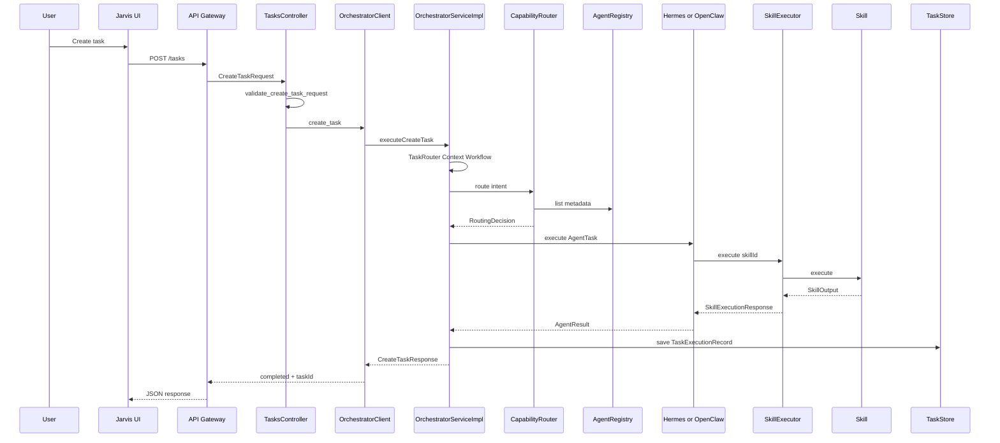
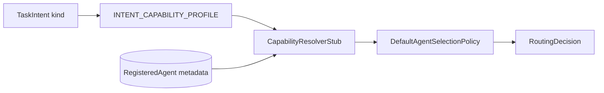
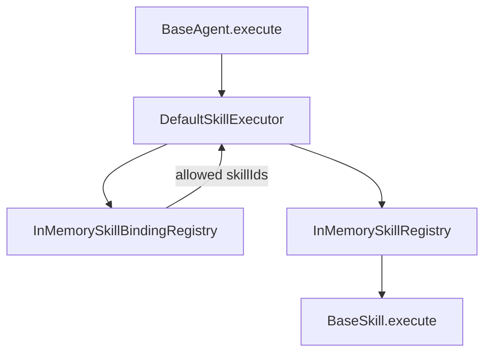
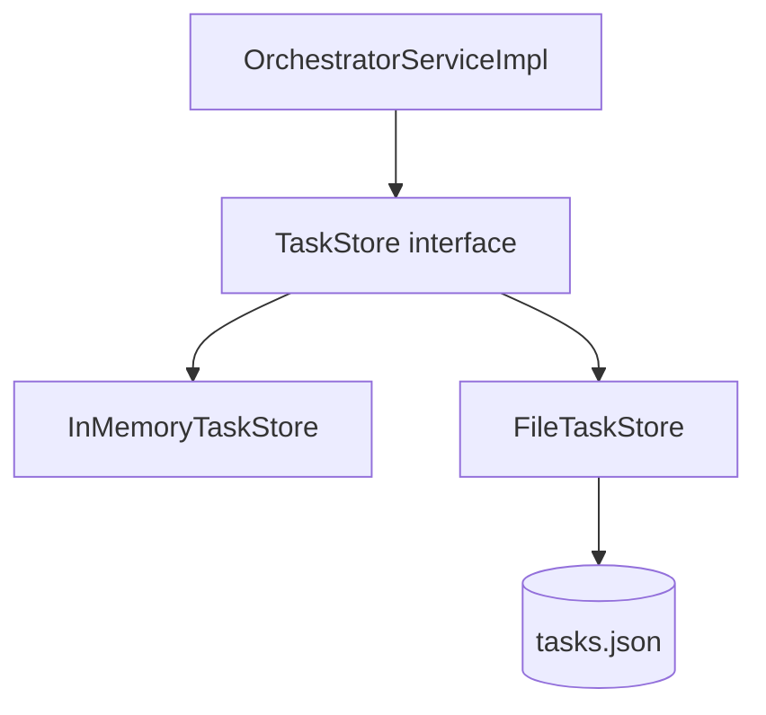

# Jarvis OS — Architecture Snapshot

Point-in-time view after **Phase 15**. All execution paths described below use **stub/static** implementations unless marked future.

---

## System context

```mermaid
flowchart TB
  subgraph clients [Clients]
    Web[apps/web Next.js]
    Desktop[apps/desktop Electron]
  end

  subgraph gateway [API Gateway]
    API[FastAPI services/api-gateway]
  end

  subgraph core [Jarvis Core]
    ORCH[@jarvis/orchestrator]
    MEM[@jarvis/memory-service]
  end

  subgraph agents_layer [Agents]
    H[Hermes]
    OC[OpenClaw Gateway]
  end

  subgraph skills_layer [Skills]
    SS[search-skill]
    BS[browser-skill]
    FS[file-skill]
  end

  Web --> API
  Desktop --> API
  API --> ORCH
  ORCH -.->|future HTTP| MEM
  ORCH --> H
  ORCH --> OC
  H --> SS
  OC --> BS
  OC --> FS
```

---

## Primary request flow (POST /tasks)



ASCII equivalent:

```
User
  ↓
Jarvis UI (apps/web | apps/desktop)
  ↓
API Gateway (FastAPI) — POST /tasks
  ↓
TasksController + validators
  ↓
OrchestratorClient (stub | LocalCliTransport → cli.ts)
  ↓
OrchestratorServiceImpl.executeCreateTask()
  ↓
TaskRouter → ContextManager → WorkflowManager
  ↓
CapabilityRouter → AgentRegistry (LiveAgentRegistry)
  ↓
Selected Agent (Hermes | openclaw-gateway)
  ↓
SkillExecutor → SkillRegistry → Skill
  ↓
TaskStore.save()
  ↓
CreateTaskResponse + TaskStatusResponse
  ↓
HTTP Response
```

---

## Capability routing flow



| Intent kind | Required capabilities (stub map) | Typical selection |
|-------------|----------------------------------|-----------------|
| `automate` | execution, browser-automation, desktop-automation | `openclaw-gateway` |
| `plan`, `research`, `draft` | planning, reasoning, … | `hermes` |
| unknown | `default` profile | `hermes` (fallback) |

---

## Agent → skill pipeline



| Agent ID | Bound skill IDs |
|----------|-----------------|
| `hermes` | `search-skill` |
| `openclaw-gateway` | `browser-skill`, `file-skill` |

Agents **must not** import concrete skill classes — only `SkillExecutor` + skill id strings.

---

## API gateway internal flow

```
HTTP Request
  ↓
FastAPI route (app/routes/tasks.py)
  ↓
Depends → TasksController
  ↓
validate_create_task_request (app/validators/tasks.py)
  ↓
OrchestratorClient
  ├─ StubOrchestratorClient (JARVIS_ORCHESTRATOR_CLIENT=stub)
  └─ LocalBridgeOrchestratorClient
        ↓
     LocalCliTransport
        ↓
     npx tsx orchestrator-bridge/cli.ts createTask
```

**Routes (implemented):**

| Method | Path | Controller |
|--------|------|------------|
| POST | `/tasks` | `TasksController.create_task` |
| GET | `/tasks/{task_id}` | `TasksController.get_task_status` |
| POST | `/conversations` | `ConversationsController` (stub reply) |

---

## Orchestrator module map

```
@jarvis/orchestrator
├── task-router/          TaskRouterStub
├── context-manager/      ContextManagerStub
├── workflow-manager/     WorkflowManagerStub
├── execution-manager/    ExecutionManagerStub (not on hot path for Phase 14 create)
├── agent-registry/       LiveAgentRegistry | AgentRegistryStub
├── capability-routing/   CapabilityRouterStub
├── task-execution/       executeCreateTask, extractSkillOutput
└── storage/              TaskStore, InMemoryTaskStore, FileTaskStore, TaskStoreFactory
```

**Service entry points:**

- `createDefaultOrchestratorService()` — production dev path (live agents + file store)
- `createTestOrchestratorService()` — in-memory store for tests
- `createOrchestratorService()` — stub components only (legacy tests)

---

## Storage flow (Phase 15)



| Mode | Factory / entry | Persistence |
|------|-----------------|-------------|
| Unit tests | `TaskStoreFactory.createInMemory()` | Process memory |
| CLI bridge default | `TaskStoreFactory.getSharedDefault()` | `services/api-gateway/.jarvis-task-store/tasks.json` |
| Future DB | `TaskStoreFactory.create({ kind: 'database' })` | **Not implemented** |

Record shape: `TaskExecutionRecord { createTaskResponse, taskStatus }`.

---

## Memory service (contracts only)

```
Hermes (future)
  ↓ HTTP only
Memory Service API (@jarvis/memory-service)
  ↓
MemoryProvider / RetrievalEngine (stubs)
  ↓
StorageAdapter (in-memory stub)
```

No memory routes exposed on API gateway today.

---

## Package dependency direction

```
apps/*
  → (HTTP only) → services/api-gateway

services/api-gateway
  → orchestrator-bridge/cli.ts → @jarvis/orchestrator

@jarvis/orchestrator
  → @jarvis/agents-bootstrap
  → @jarvis/agents-shared
  → @jarvis/types

@jarvis/agents-bootstrap
  → @jarvis/hermes, @jarvis/openclaw
  → @jarvis/agents-shared
  → @jarvis/search-skill, @jarvis/file-skill, @jarvis/browser-skill

@jarvis/hermes | @jarvis/openclaw
  → @jarvis/agents-shared (SkillExecutor)

skills/*
  → @jarvis/skills-shared
  → @jarvis/types
```

---

## Security and boundary rules

| Boundary | Rule |
|----------|------|
| UI → OpenClaw | **Forbidden** |
| UI → Orchestrator | **Forbidden** (via API only) |
| API → Agents | **Forbidden** (via orchestrator only) |
| Agents → Skills | Via `SkillExecutor` + registry only |
| Hermes → Memory | Memory Service APIs only |
| OpenClaw execution | Sandbox + permissions (future) |

---

## Technology stack snapshot

| Layer | Technology |
|-------|------------|
| Monorepo | Turborepo, npm workspaces |
| UI | Next.js, Electron, TypeScript strict |
| API | FastAPI, Pydantic, pytest |
| Core | TypeScript, Vitest |
| Orchestrator bridge | tsx CLI subprocess |
| Persistence (dev) | JSON file via `FileTaskStore` |
| Persistence (prod) | TBD — PostgreSQL planned |

---

## Related docs

- [ARCHITECTURE.md](./ARCHITECTURE.md) — canonical layer rules
- [PROJECT_STATUS.md](./PROJECT_STATUS.md) — current state summary
- [COMPLETED_PHASES.md](./COMPLETED_PHASES.md) — phase delivery log
