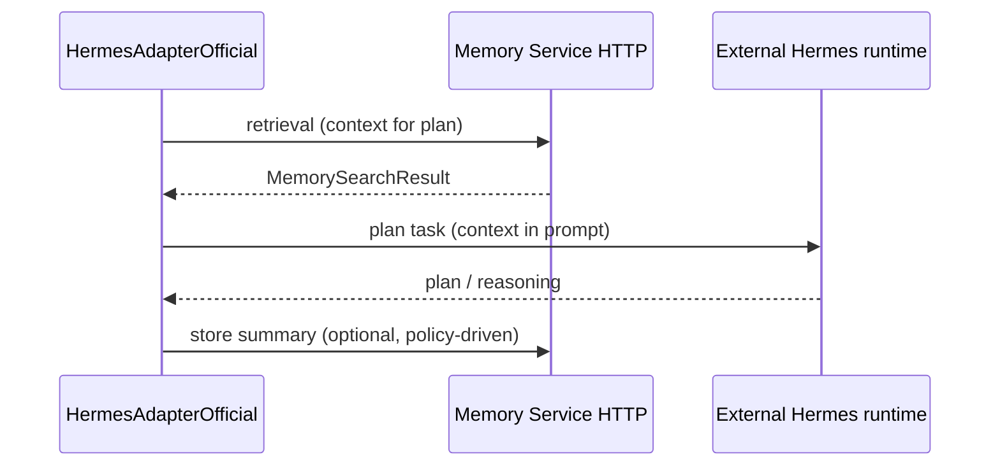
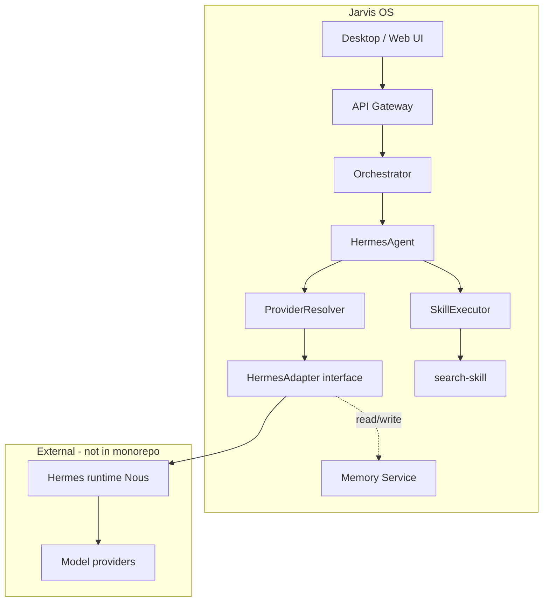

# Hermes Integration Plan (Phase 19)

**Status:** Research and implementation plan — documentation only.  
**Scope:** How Jarvis OS should integrate an **official external Hermes runtime** behind existing `HermesAdapter` boundaries without copying source into the monorepo.

---

## 1. Purpose

Jarvis treats **Hermes** as the planning and reasoning agent in the internal architecture (`agents/hermes`). Phase 16 introduced `HermesAdapter`; Phase 17 introduced `@jarvis/provider-registry` with `hermes-local` and `hermes-cloud`. Phase 19 defines how a **real** Hermes runtime plugs in while preserving:

```
UI → API Gateway → Orchestrator → HermesAgent → HermesAdapter → External Hermes runtime
                                                      ↘ SkillExecutor → Skills
```

Persistent memory remains owned by **Jarvis Memory Service** — not the external agent’s private store.

---

## 2. Official repository information

### 2.1 Primary reference (candidate official target)

| Field | Value |
|-------|--------|
| **Project** | Hermes Agent (Nous Research) |
| **Repository** | [https://github.com/NousResearch/hermes-agent](https://github.com/NousResearch/hermes-agent) |
| **Documentation** | [https://hermes-agent.nousresearch.com](https://hermes-agent.nousresearch.com) (linked from README) |
| **License** | Check repository `LICENSE` at integration time (do not assume) |
| **Language / stack** | Python (agent loop, CLI, gateway, tooling) |
| **Maintainer** | Nous Research |

**Alignment with Jarvis naming:** Jarvis documentation and rules use “Hermes” for planning, reasoning, memory-access (via Jarvis APIs), and task decomposition. Nous Hermes Agent is the closest **public, official** project matching that role. **Product owners must confirm** this is the intended external system before implementation.

### 2.2 Related / avoid confusion

| Name | Notes |
|------|--------|
| `Hermesagents/hermes-agents` | Unrelated fork/community repo; **not** the integration target unless explicitly chosen |
| Generic “Hermes” LLM model names | Model branding only — not an agent runtime |
| Jarvis `@jarvis/hermes` package | **Internal** agent shell — not the external runtime |

### 2.3 Integration rule (Jarvis policy)

- **Do not clone** or vendor `NousResearch/hermes-agent` into `agents/` or `packages/`.
- Integrate via **official APIs, CLI, or documented gateway protocols** only.
- Keep all Jarvis-specific logic in `HermesAdapter` implementations under `agents/hermes/adapter/`.

---

## 3. Runtime requirements

### 3.1 External Hermes (Nous) — documented expectations

From public README and docs (verify at implementation time):

| Requirement | Typical expectation |
|-------------|---------------------|
| **Runtime** | Python 3.x, CLI `hermes` after install |
| **Model access** | API keys for Nous Portal, OpenRouter, OpenAI, or compatible endpoints |
| **Deployment** | Local machine, VPS, Docker, SSH, Modal/Daytona backends (external to Jarvis) |
| **Gateway** | Optional long-lived gateway for Telegram/Discord/Slack/etc. (Jarvis does **not** use these channels for product UI) |
| **Hardware** | GPU optional; cloud or local inference via chosen provider |
| **Network** | Outbound HTTPS to model providers when not fully local |

### 3.2 Jarvis-side requirements (already in monorepo)

| Component | Requirement |
|-----------|-------------|
| Node.js | ≥ 20 (orchestrator, agents, desktop) |
| `@jarvis/hermes` | `HermesAgent` + `SkillExecutor` |
| `@jarvis/provider-registry` | `hermes-local` \| `hermes-cloud` selection |
| API gateway | Running for end-to-end tasks (`POST /tasks`) |
| Memory service | HTTP API (future) for Hermes memory-access capability |

### 3.3 `hermes-local` vs `hermes-cloud` (Jarvis providers)

| Provider id | Intended deployment | External runtime expectation |
|-------------|---------------------|------------------------------|
| `hermes-local` | Same host or LAN as Jarvis orchestrator | Loopback or private URL to Hermes CLI/gateway |
| `hermes-cloud` | Remote VPS / managed Hermes | TLS endpoint; token auth; no Jarvis UI exposure |

---

## 4. API / runtime interface expectations

### 4.1 What Nous Hermes exposes (research summary)

Public surfaces to evaluate during implementation (no code in this phase):

| Surface | Use for Jarvis? | Notes |
|---------|-----------------|-------|
| **CLI** (`hermes`, onboarding wizard) | Possibly ops only | Good for dev/provisioning, not for per-task orchestrator latency |
| **Python API** (`run_agent.py`, `AIAgent` class per README examples) | **Candidate** | Subprocess or sidecar with strict IPC contract |
| **Gateway / messaging** (Telegram, Discord, …) | **No** | Violates “user only sees Jarvis UI” |
| **Skills / agentskills.io** | **Bridge carefully** | Map to Jarvis `@jarvis/skills-*`, do not duplicate registry |
| **Cron / heartbeat** | **No** for v1 | Jarvis orchestrator owns scheduling |
| **Built-in memory / Honcho / FTS5** | **Disabled or read-only bridge** | See §5 |

### 4.2 Jarvis adapter contract (unchanged)

Existing interface in `agents/hermes/adapter/`:

```typescript
interface HermesAdapter {
  readonly adapterId: string;
  invoke(request: HermesRequest, config?: HermesConfig): Promise<HermesResponse>;
}
```

**Official adapter** (`HermesAdapterOfficial` — name TBD) must:

1. Accept `HermesRequest` built from `AgentTask` + `AgentContext`.
2. Call external runtime (subprocess, HTTP, or WebSocket — TBD after spike).
3. Map external output → `HermesResponse` (`plan`, `reasoning`, `success`, `error`).
4. Never persist memory directly — delegate reads/writes to Memory Service client when needed.

### 4.3 Suggested runtime bridge patterns (implementation options)

| Pattern | Pros | Cons |
|---------|------|------|
| **A. HTTP client → Hermes gateway** (if stable HTTP API exists) | Clean boundary, scalable | Must confirm official HTTP contract |
| **B. Subprocess CLI** (`hermes run …`) | Simple isolation | Parsing, versioning, timeouts |
| **C. Sidecar Python service** | Controlled API | Extra deployment unit |
| **D. OpenAI-compatible proxy** (if Hermes exposes one) | Reuse HTTP clients | May not match planning semantics |

**Recommendation:** Spike **B or C** for `hermes-local`; **A or C** with mTLS for `hermes-cloud`. Document chosen protocol in a follow-up ADR before merge.

---

## 5. Memory interaction rules

Jarvis non-negotiable rules (from architecture docs):

| Rule | Implication for Hermes integration |
|------|----------------------------------|
| **Jarvis Memory Service owns persistence** | All long-term user/task memory stored via `@jarvis/memory-service` |
| **Hermes must not write local DB/files** for product memory | Disable or ignore Nous Hermes internal memory loops in integrated mode |
| **Hermes `memory-access` capability** | Implemented as Memory Service **HTTP client** from adapter or agent helper — not Honcho/FTS5 |

### 5.1 Conflict: Nous Hermes built-in memory

Nous Hermes advertises agent-curated memory, session search, and Honcho user modeling. **These must not become the system of record for Jarvis.**

| External feature | Jarvis handling |
|------------------|-----------------|
| Agent-curated memory | **Off** or ephemeral scratch only |
| Cross-session FTS5 / Honcho | **Do not sync** into Jarvis without explicit ETL plan |
| Skill persistence | Map to Jarvis skills registry, not parallel tree |

### 5.2 Target memory flow (future)



---

## 6. Adapter mapping to Jarvis architecture

### 6.1 Layer diagram



### 6.2 Component mapping table

| Jarvis component | Role with official Hermes |
|------------------|---------------------------|
| `CapabilityRouter` | Selects `hermes` agent id (unchanged) |
| `ProviderResolver` | Resolves `hermes-local` / `hermes-cloud` |
| `ProviderSelectedHermesAdapter` | Chooses config + delegates to official adapter |
| `HermesAdapterOfficial` | **New** — only integration point to external runtime |
| `HermesAgent` | Orchestrates adapter + `SearchSkill` (skills remain Jarvis) |
| `SearchSkill` | Stays mock/real per phase; not replaced by Hermes tools |

### 6.3 Data mapping

| Jarvis `HermesRequest` | External input |
|------------------------|----------------|
| `taskId`, `requestId`, `userId` | Correlation / tracing ids |
| `intent.kind`, `intent.description` | Primary user goal |
| `contextRef` | Join key for Memory Service retrieval |
| `workflowStepId`, `correlationId` | Propagate for observability |

| Jarvis `HermesResponse` | External output |
|-------------------------|-----------------|
| `plan.steps` | Decomposed steps from external planner |
| `plan.summary` | Natural language plan |
| `reasoning.summary` | Chain-of-thought summary (sanitized for UI) |
| `reasoning.confidence` | Heuristic or model metadata |
| `adapterId` | `hermes-local` or `hermes-cloud` provider id |

---

## 7. Implementation phases (planned, not executed)

| Phase | Deliverable |
|-------|-------------|
| **19** (this doc) | Research + plan |
| **20** | Hermes runtime spike (local CLI or HTTP), timeout/error mapping |
| **21** | `HermesAdapterOfficial` + feature flag `JARVIS_HERMES_MODE=stub\|official` |
| **22** | Memory Service HTTP wired to adapter retrieval |
| **23** | `hermes-cloud` hardening (auth, retries, circuit breaker) |

---

## 8. Risks and limitations

### 8.1 Technical risks

| Risk | Severity | Mitigation |
|------|----------|------------|
| External API instability | High | Version pin; adapter isolation; stub fallback |
| Duplicate memory systems | High | Disable external memory; contract tests |
| Latency (LLM + planning) | Medium | Timeouts; async task status; user feedback in UI |
| Skill overlap (Hermes skills vs Jarvis skills) | Medium | Single registry in Jarvis; map imports |
| Subprocess sandbox escape | Medium | Run external runtime in container; least privilege |
| Model cost / rate limits | Medium | Provider quotas; user tenancy (future) |

### 8.2 Product / architecture limitations

| Limitation | Notes |
|------------|--------|
| Jarvis UI never shows “Nous Hermes” branding | Adapter is invisible; user sees Jarvis only |
| No Telegram/Discord routing through Jarvis desktop | External channels remain out of scope |
| Planning without execution | Hermes does not run OpenClaw; orchestrator routes `automate` to OpenClaw |
| Stub mode required for CI | `HermesAdapterStub` stays default in tests |

### 8.3 Compliance and security

- API keys for model providers must live in **secrets management**, not repo.
- Prompt content may include user data — align with future auth/tenancy and data policy.
- Log redaction required before shipping official mode.

---

## 9. Open questions (resolve before implementation)

1. Confirm **NousResearch/hermes-agent** is the approved external Hermes.
2. Choose **local bridge** mechanism (CLI vs HTTP vs sidecar).
3. Define **SLA** for `invoke()` timeout (orchestrator task budget).
4. Decide whether **SearchSkill** remains or Hermes tools subsume search in v2.
5. Legal review of upstream **license** and attribution requirements.

---

## 10. References

| Resource | URL |
|----------|-----|
| Nous Hermes Agent (GitHub) | https://github.com/NousResearch/hermes-agent |
| Hermes Agent docs | https://hermes-agent.nousresearch.com |
| Jarvis adapter README | `agents/hermes/adapter/README.md` |
| Provider registry | `packages/provider-registry/README.md` |
| Jarvis architecture | `docs/ARCHITECTURE.md` |
| Memory contracts | `packages/types/src/memory/` |

---

*Phase 19 — documentation only. No repository cloning or implementation in this phase.*
