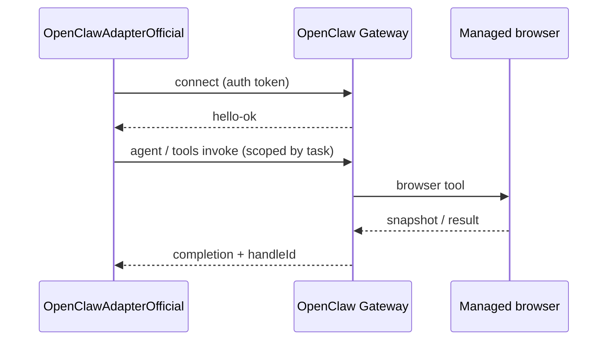
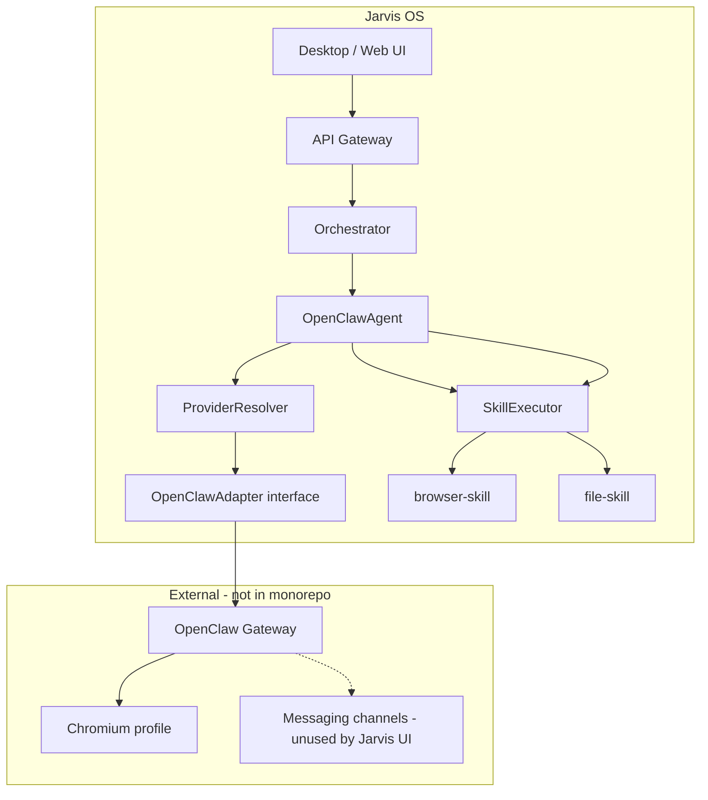
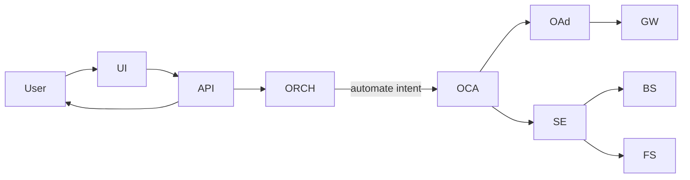

# OpenClaw Integration Plan (Phase 19)

**Status:** Research and implementation plan — documentation only.  
**Scope:** How Jarvis OS should integrate the **official OpenClaw gateway** behind existing `OpenClawAdapter` boundaries without copying source or calling OpenClaw from the UI.

---

## 1. Purpose

Jarvis treats **OpenClaw** as the execution gateway for browser and desktop automation (`agents/openclaw`, agent id `openclaw-gateway`). Phase 16 introduced `OpenClawAdapter`; Phase 17 added `openclaw-local` and `openclaw-remote` providers. Phase 19 documents the **official external OpenClaw runtime** and how it maps into Jarvis while preserving:

```
UI → API Gateway → Orchestrator → OpenClawAgent → OpenClawAdapter → External OpenClaw Gateway
                                                        ↘ SkillExecutor → browser-skill, file-skill
```

The **frontend must never** import, configure, or call OpenClaw directly.

---

## 2. Official repository information

### 2.1 Primary reference

| Field | Value |
|-------|--------|
| **Project** | OpenClaw |
| **Repository** | [https://github.com/openclaw/openclaw](https://github.com/openclaw/openclaw) |
| **Documentation** | [https://docs.openclaw.ai](https://docs.openclaw.ai) |
| **License** | Check repository `LICENSE` at integration time |
| **Stack** | Node.js gateway, TypeScript tooling, CLI `openclaw` |
| **Description** | Personal AI assistant / agentic gateway — channels, tools, browser, skills |

### 2.2 Key documentation areas

| Topic | Doc path (docs.openclaw.ai) |
|-------|-----------------------------|
| Gateway | `/gateway` |
| Browser automation | `/tools/browser`, `/cli/browser` |
| Tools & skills | `/tools`, `/tools/skills` |
| Configuration | Gateway configuration reference |
| Security / auth | Gateway authentication, secrets |
| Remote access | Tailscale, SSH tunnel, remote gateway |

### 2.3 Integration rule (Jarvis policy)

- **Do not clone** `openclaw/openclaw` into Jarvis monorepo.
- Integrate via **Gateway protocol** (WebSocket / HTTP) and documented CLI surfaces.
- All Jarvis-specific policy (sandbox, permissions, task correlation) lives in `OpenClawAdapter` and orchestrator.

---

## 3. Execution model (external OpenClaw)

### 3.1 Gateway-centric architecture

OpenClaw’s control plane is a **long-lived Gateway process**:

| Aspect | Behavior |
|--------|----------|
| **Process** | Single multiplexed gateway (default port **18789**, loopback bind) |
| **Protocols** | WebSocket RPC (`connect` → `hello-ok` → `req`/`res`); HTTP APIs on same port |
| **HTTP surfaces** | OpenAI-compatible routes (`/v1/chat/completions`, `/v1/responses`, …), `/tools/invoke`, plugin routes |
| **Agent runs** | Two-stage: accepted ack, then completion with streamed events |
| **Channels** | WhatsApp, Telegram, Slack, etc. — **out of scope for Jarvis UI** |
| **Browser** | Dedicated managed browser profile; `browser` tool (snapshot, act, navigate) |
| **Skills** | Bundled and workspace skills; ClawHub community registry |

### 3.2 Browser automation model

From official browser docs:

| Concept | Description |
|---------|-------------|
| **Profiles** | `openclaw` (isolated Chromium), `user` (CDP to existing Chrome), remote CDP |
| **Targets** | `sandbox` \| `host` \| `node` — where browser runs |
| **Agent tool** | `browser` — status, tabs, snapshot, screenshot, navigate, act |
| **Sandbox flag** | `agents.defaults.sandbox.browser.allowHostControl` gates host control from sandboxed sessions |
| **CLI** | `openclaw browser …` proxies to gateway |

### 3.3 Runtime requirements

| Requirement | Typical value |
|-------------|----------------|
| **Node.js** | Per OpenClaw install docs (verify on target version) |
| **OS** | macOS, Linux; Windows via WSL2 recommended |
| **Resources** | ~2 GB RAM minimum; ~4 GB with browser automation (community/docs guidance) |
| **Gateway auth** | Required by default — token/password or trusted-proxy mode |
| **Chromium** | For managed `openclaw` browser profile |

### 3.4 Jarvis provider mapping

| Provider id | OpenClaw deployment | Connection |
|-------------|---------------------|------------|
| `openclaw-local` | Gateway on same host as Jarvis orchestrator | `ws://127.0.0.1:18789` (or configured port) |
| `openclaw-remote` | Gateway on remote host | SSH tunnel or VPN; token auth |

---

## 4. Permission model (external + Jarvis)

### 4.1 OpenClaw gateway auth

| Mechanism | Use case |
|-----------|----------|
| `gateway.auth.token` / `OPENCLAW_GATEWAY_TOKEN` | Shared secret for clients |
| `gateway.auth.password` | Alternative secret |
| `gateway.auth.mode: trusted-proxy` | Behind reverse proxy |
| **Loopback default** | Refuses non-loopback bind without auth |

Jarvis **OpenClawAdapterOfficial** must store gateway credentials in environment/secrets — never in renderer or repo.

### 4.2 Tool and sandbox permissions (OpenClaw)

| Control | Meaning for Jarvis |
|---------|-------------------|
| **Sandbox sessions** | Default safer; browser `target` may be `sandbox` |
| **Host browser control** | Explicit config flag required |
| **Skills from ClawHub** | Security risk — Jarvis should **not** auto-install unvetted skills |
| **Shell / file tools** | Map to Jarvis `file-skill` policy; deny or allowlist per task |

### 4.3 Jarvis permission model (product rules)

Existing Jarvis rules (implementation future):

| Gate | Description |
|------|-------------|
| **Orchestrator-only invocation** | No UI → OpenClaw path |
| **Task-scoped execution** | `OpenClawRequest` carries `taskId`, `userId`, `workflowStepId` |
| **User approval** (planned) | Desktop/UI prompt before destructive automation |
| **Capability routing** | Only `automate` (and related) intents reach OpenClaw |
| **Audit log** | Correlate gateway handle with Jarvis task id |

`OpenClawAdapterStub` currently sets `permissionsChecked: false` — official adapter must flip to `true` only after Jarvis policy engine approves.

---

## 5. Sandbox rules

### 5.1 Jarvis sandbox principles

| Rule | Rationale |
|------|-----------|
| **Assume hostile web** | Browser automation runs in isolated profile |
| **No host browser by default** | Prefer OpenClaw `openclaw` profile, not `user` Chrome |
| **Network egress allowlist** | Gateway host firewall + Jarvis policy (future) |
| **Secrets isolation** | Gateway tokens not exposed to renderer |
| **One task ↔ one handle** | `handleId` ties automation session to `taskId` |

### 5.2 Mapping OpenClaw sandbox features

| OpenClaw feature | Jarvis policy |
|------------------|---------------|
| `target: "sandbox"` | **Preferred** for production Jarvis |
| `target: "host"` | Dev only; explicit env flag |
| `target: "node"` | Remote node host — maps to `openclaw-remote` with pinned node |
| Dedicated `openclaw` browser profile | **Required** — separate from user personal browser |
| Remote CDP profiles | Allowed only for `openclaw-remote` with network controls |

### 5.3 Skills vs Jarvis skills

Jarvis already implements **static** `browser-skill` and `file-skill`. Official integration options:

| Approach | Description |
|----------|-------------|
| **A. Adapter invokes gateway `browser` tool** | OpenClaw executes; Jarvis skills become thin wrappers or deprecated |
| **B. Jarvis skills remain canonical** | Adapter only validates/approves; skills stay mock/real in Jarvis |
| **C. Hybrid** | Adapter opens handle; skills request actions via adapter RPC |

**Recommendation:** Start with **B** (policy + handle in adapter) then evolve to **A** for real browser actions in a later phase — keeps `SkillExecutor` pipeline stable.

---

## 6. API / runtime interface expectations

### 6.1 Jarvis adapter contract (unchanged)

```typescript
interface OpenClawAdapter {
  readonly adapterId: string;
  invoke(request: OpenClawRequest, config?: OpenClawConfig): Promise<OpenClawResponse>;
}
```

`OpenClawResponse` includes `execution.status`, `execution.handleId`, `execution.sandbox`, `approvedActions`.

### 6.2 Expected external interfaces

| Interface | Purpose |
|-----------|---------|
| **WebSocket Gateway protocol** | Primary control: connect, agent runs, tool invoke |
| **HTTP `/tools/invoke`** | Possible narrow surface for browser/file actions |
| **CLI `openclaw browser …`** | Debugging; optional subprocess bridge for local dev |
| **OpenAI-compatible HTTP** | **Not** primary for Jarvis execution routing |

### 6.3 Suggested bridge design



**Correlation:** Pass Jarvis `taskId` in session metadata or tool params (exact field TBD from gateway protocol spike).

---

## 7. Adapter mapping to Jarvis architecture

### 7.1 Layer diagram



### 7.2 End-to-end flow (target)



### 7.3 Component mapping

| Jarvis component | Role |
|------------------|------|
| `CapabilityRouter` | Routes `automate` → `openclaw-gateway` |
| `ProviderResolver` | `openclaw-local` / `openclaw-remote` |
| `ProviderSelectedOpenClawAdapter` | Provider selection + delegate |
| `OpenClawAdapterOfficial` | Gateway client; permissions; handle lifecycle |
| `OpenClawAgent` | Adapter + skill pipeline |
| `browser-skill` / `file-skill` | Jarvis skills (static → real via gateway later) |

### 7.4 Data mapping

| `OpenClawRequest` | Gateway / session |
|-------------------|-------------------|
| `taskId` | Session correlation id |
| `intent.description` | Agent goal text |
| `requestedActions` | Tool allowlist (`browser`, `file`, …) |
| `contextRef` | Jarvis context for audit |

| `OpenClawResponse` | Gateway |
|--------------------|---------|
| `execution.handleId` | Session or run id |
| `execution.status` | accepted / rejected / pending |
| `execution.sandbox` | Reflects `target` + policy |
| `approvedActions` | Tools gateway may invoke |

---

## 8. Implementation phases (planned, not executed)

| Phase | Deliverable |
|-------|-------------|
| **19** (this doc) | Research + plan |
| **20** | Gateway connectivity spike (local WS, auth, health) |
| **21** | `OpenClawAdapterOfficial` + env `JARVIS_OPENCLAW_MODE=stub\|official` |
| **22** | Permission gate in orchestrator + desktop approval UI |
| **23** | Real `browser-skill` → gateway `browser` tool bridge |
| **24** | `openclaw-remote` via SSH tunnel / Tailscale pattern |

---

## 9. Risks and limitations

### 9.1 Security risks

| Risk | Severity | Mitigation |
|------|----------|------------|
| Unvetted ClawHub skills | Critical | Disable community skill install; allowlist |
| Host browser control | High | Default `sandbox` target; config gate |
| Gateway token leakage | High | Secrets manager; never in UI bundle |
| Prompt injection via web pages | High | URL allowlist; read-only modes where possible |
| Multi-tenant bleed | High | Separate gateway instances per tenant (future) |

Official docs and third-party audits note skill-supply-chain concerns — Jarvis must **not** expose raw skill installation to end users.

### 9.2 Operational limitations

| Limitation | Notes |
|------------|--------|
| Gateway single point of failure | Health checks; restart policy; `openclaw doctor` in runbooks |
| Port 18789 conflicts | Configurable `gateway.port` |
| WSL2 required on Windows | Document for Jarvis desktop users |
| Latency | Browser snapshots are slow — async task status in UI |
| No channel integrations in Jarvis v1 | Telegram/WhatsApp remain external to product |

### 9.3 Architecture limitations

| Limitation | Notes |
|------------|--------|
| UI never calls OpenClaw | Non-negotiable |
| Hermes does not replace OpenClaw | Planning vs execution split preserved |
| Stub CI required | `OpenClawAdapterStub` default in tests |
| Jarvis skills may duplicate gateway tools | Converge in phased plan (§5.3) |

---

## 10. Open questions (resolve before implementation)

1. **Single shared gateway** vs one gateway per Jarvis tenant?
2. Canonical bridge: **WebSocket RPC** vs **HTTP /tools/invoke** only?
3. How to represent **user approval** in `OpenClawResponse` before skills run?
4. Deprecation timeline for **Jarvis mock browser-skill** when gateway is live?
5. **Remote** deployment: Tailscale vs SSH tunnel as official Jarvis pattern?

---

## 11. References

| Resource | URL |
|----------|-----|
| OpenClaw GitHub | https://github.com/openclaw/openclaw |
| OpenClaw docs | https://docs.openclaw.ai |
| Gateway operations | https://docs.openclaw.ai/gateway |
| Browser tool | https://docs.openclaw.ai/tools/browser |
| Jarvis adapter README | `agents/openclaw/adapter/README.md` |
| Provider registry | `packages/provider-registry/README.md` |
| Jarvis architecture | `docs/ARCHITECTURE.md` |

---

*Phase 19 — documentation only. No repository cloning or implementation in this phase.*
